Товарищъ Ленин ⚡️ (@JIEHiH) ☭December 21, 2017

Добро пожаловать, в мир **StartupWars(SW)**. Эта статья поможет Вам не потеряться в игровом процессе. Даст минимально нужные знания о механики игры, поможет советом в прокачке.

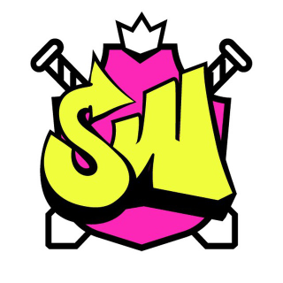

## Старт

В игре существует 5 компаний: ☂️Umbrella, 📯Pied Piper, 🤖Hooli, ⚡️Stark Ind, 🎩Wayne Ent.

На данном фото размещен профиль, в нем можно пронаблюдать Ваш ник, лвл, опыт, ресурсы, количество мотивации, заполненность рюкзака, ваши навыки и состояние на следующую битву.

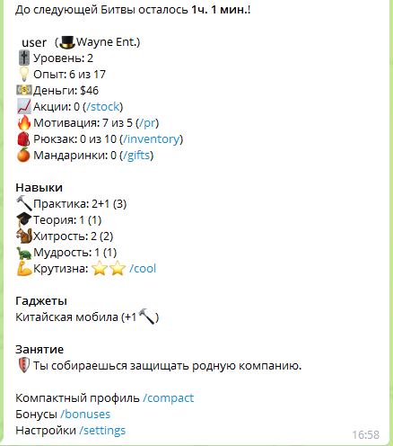

**В игре существует 4 основных навыка персонажа:**

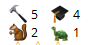

* 🔨 Практика — Параметр отвечающий за урон по врагу.
* 🎓 Теория — Параметр отвечающий за твою защиту.
* 🐿 Хитрость — Параметр который помогает попасть по врагу.
* 🐢 Мудрость — Параметр, что позволяет увернуться от вражеского удара.

Как проходят битвы мы рассмотрим дальше. Более подробно о битвах можно почитать по команде `/help_skills` в игровом боте.

> **Совет:** для более эффективного результата лучше параметры качать равномерно.

Параметры влияют на твой результат в битве. Сами же **битвы проходят в 10, 13, 16, 19, 22 часа по МСК**. Лучшее направление для битвы лучше смотреть в общем чате свое корпорации или же отряде, что лучше уточнить у своего СЕО (глава компании). Направление выглядит простым образом и переводит Вас в боевое состояние просто нажав на кнопку в чате. Остается активным до наступления битвы.

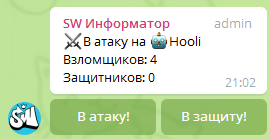

Пройдя обучение в игровом боте ты начинаешь самостоятельную жизнь со 2 уровня, вот с этого момента игру можно поделить на различные этапы.

Если вы имеете аккаунт в Чв (Запрещенная на территории SW организация), то Вам стоит ознакомиться с [ЭТИМ](#переезд) пунктом, если нет, то мы просто идём дальше.

## 2-5 лвл

Короткий, но не маловажный период игры. Ранний этап должен быть удачный в плане накопления денег. В нем вам доступный действия "🚶Гулять" и "💻Работать", "🏢Офис".

`Работа` — ничем не отличается от повседневной работы такая же скучная, но не маловажная, приносит больше денег 💵, но меньше опыта 💡.

`Гулять` — прогулки по свежему воздуху позволит вам добыть неплохое количество опыта 💡 и небольшую горстку монет 💵.

`Офис` — офис делиться на 2 составляющие "[Лаборатории](#лаборатории)" и "[Мастерская](#мастерская)". На данном этапе, они нам не понадобятся и почитать о них стоит позже или перейдя на них по ссылкам.

> **Совет:** для стартового накопления денег, лучше тратить мотивацию на "Работу".

Плюс к этому вам поможет начальный бонус в виде стартового бонуса на 3 часа.
"*💊&nbsp;Стартовый бонус - в 2 раза больше опыта и денег с работы и прогулки.*"

А так же до 12 лвл, над вами появляется божественный щит. Он защищает Вас от денежных потерь в битве, кроме случая когда Вы не пробили защиту противника. Что так же помогает копить Вам деньги.

Немаловажный момент, что до 12 лвл восстановление мотивации ускорено в 2 раза, что позволит ходить на "Работу" и копить деньги в 2 раза быстрее.

Так же вы могли заметить, что у Вас появилась ещё не понятная штука - это сырье

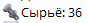

Пока Вам стоит знать, что оно может выпасть с "*Работы*" и "*Гулять*", в количестве от 1-2🔩 и пока не играет Вам особой роли. Просто копите.

А так же вы уже сейчас можете посмотреть свой результат по прошлой битве командой `/battle` в игровом боте.

## 5 лвл

Ты уже бравый вояка и теперь тебе пора погрязнуть максимально в мир SW и познакомиться с новыми доступными функциями.

Появился основной параметр: *🔋&nbsp;Выносливость*. Выносливость выступает в роли вашего ХП в битвах, больше ХП, больше шансов на победу. Пополнить Хп можно несколькими способами, но основной способ "*Есть*".

Есть - еда обычно дело для нашей жизни, но бесплатный сыр только в мышеловках. Стоимость данной процедуры списывает у Вас 5 💵. Но результат вашего обеда не постоянен и имеет 3 исхода:

* 100% — обычный обед, самый частый результат после дела "*Есть*".
* 200% — великолепный приём пищи, давший вам новый прилив сил, происходит не часто, очень приятное событие.
* 0% — не всегда мы питаемся здоровой пищей, к сожалению есть последствия, происходит так же крайне редко, но не вызывает положительных эмоций.

*Фастфуд* — быстрый перекус, который позволит сам мгновенно восстановить свои силы даже во время какого либо занятия, кроме "Есть" и "Спать". Использование фастфуда ограничено одним разом в пол часа.

На текущий момент есть 3 типа фастфуда:

* 🌭 Хот-дог (🔋 50-140%).
* 🍕 Пицца (🔋 70-160%).
* 🍔 Бургер (🔋 90-180%).

Так же Вам доступен и другой способ пополнить *🔋&nbsp;Выносливость*, это дело "*Спать*". Основной задачей сна является не восстановления выносливости, а сброс счётчика. Счетчик сна является таймер времени и равен 72 часа с момента последнего пробуждения.

> **!!Внимание!!** По окончанию таймера, Ваш герой автоматически идет в локацию "Под мост" на 12 часов, но так же сохраняет возможность пробуждения.

Для сброса счетчика есть два варианта:

* **Под мост** — не совсем уютное и безопасное место для сна, но если финансы поют романсы, приходится составлять компанию таким же поселенцам под мостом. Главный минус сна "*Под мостом*" — это возможность потерять свои наличные деньги. Во время грабежа у тебя отнимают 30% от наличных, а вы дальше продолжаете видеть сны, при пробуждении получаете *100% 🔋 выносливости* и счетчик в 72 часа. Но у тебя всегда есть шанс дать отпор. При грабеже боту приходит уведомление и у Вас есть 4 минуты, что бы вступить в схватку с грабителем, при успехе битвы вы разживетесь его наличкой в размере 50%, а при проигрыше грабитель вырывает 15% от вашего капитала и убегает. После схватки с грабителем Вы просыпаетесь, счётчик принимает значение в 72 часа, а 🔋выносливость принимает значение оставшееся после схватки.
* **Отель** — спать в удобной кроватке всегда хорошо и безопасно, но не всегда по карману, за сон в отеле Вам придется заплатить сумму равную lvl*3 💵. Но при пробуждении Вас ждёт приятный бонус в размере 150% 🔋 выносливости.

> **!!Внимание!!** Грабеж под мостом происходит не более 1 раза за фазу сна. Размер выносливости не зависит от количества времени проведенных в "Отеле" или "Под мостом". P.S Все ваши деньги с битвы во время сна не отнимает.
Совет: Если на вашем таймере меньше после битвы в 22 по МСК меньше 24 часов отправляйтесь спать, что бы не пропускать битвы.Сливайте деньги перед сном "Под мостом"

> **Совет:** Если на вашем таймере меньше после битвы в 22 по МСК меньше 24 часов отправляйтесь спать, что бы не пропускать битвы.Сливайте деньги перед сном "Под мостом"

### Битвы

Основой StartupWars служат **битвы** между корпорациями, поэтому понимать, как проходят эти сражения довольно важно.

Вот краткое описание этого занимательного процесса: берется сначала самый сильный защитник и напротив стоящий нападающий, они дерутся между собой, проигравший теряет всю свою выносливость и выбывает из битвы, победивший теряет часть выносливости и встаёт в конец очереди. Чем выше твои навыки, тем проще победить оппонента, тем меньше выносливости ты потеряешь, а значит если до тебя доходит очередь ещё раз, то шанс убрать ещё одного соперника выше. По итогу заработаешь больше опыта и денег, максимум можно убрать только 4 соперников. Но это так же не всё, что бы не забивать голову, я расскажу о них дальше.

## 6 лвл

На 6 лвл тебе выдается первая твоя акция. С этого момента ты начал свой путь акционера. Покупка акций своей компании будет приносить тебе дивиденды от битв за день. Дивиденды начисляются каждый день в 2 часа по Москве. Чем больше своих акций, тем больше будут твои дивиденды. Но помимо своих акций ты можешь вкладываться в чужие акции. Вкладывая деньги во вражеские акции ты повышаешь их капитал и повышаешь количество кубков, что выпадает с них. Покупка акций происходит через биржу. Что нужно знать о покупке акций:

* За покупку/продажу акций взимается комиссия брокера - 1 💵 за шт..
* У тебя должно оставаться не менее 100 💵 после покупки акций.
* Акции дешевле 20 💵 нельзя купить. Только продать.
* Акции дороже 65 💵 нельзя продать. Только купить.
* Биржа работает с 8 до 22 по Москве.

Более подробно о акциях можно почитать в боте через команду `/help_stock`

> **!!Внимание!!** Количество своих акций на руках не ограничена, но большое их количество может привести к их потерям в битве.Утвержденное количество своих акций уточняйте у своих СЕО.

> **Совет:** чтобы увеличить максимально свой доход с дивидендов, купите своих акций до разрешенного лимита, что бы не потерять их в бою. Достигнув лимита переходите на вражеские акции.

## 10 лвл

С этого лвл открывается возможность "*Грабить*". Данное действие представляет собой поиск спящих людей под мостом. Жертва находится абсолютно случайно(шанс найти кого то 80%), которую ещё не грабили. 4 минуты происходит поиск жертвы, а ещё 4 минуты вы молитесь, что бы жертва не проснулась. Ходить на грабеж можно не чаще одного раза в час. Не всегда грабёж стоит своих свеч, но иногда, можно встретить случайно уснувшего богача и разжиться его деньгами.

> **!!Внимание!!** Уйти на грабеж можно и с 0% выносливостью, что гарантирует Вам проигрыш при пробуждении жертвы.

> **Совет:** если же вы рисковый парень, то лучше пытать свою удачу ночью, а ещё лучше после получении в 2 часа ночи дивидендов.

## 12 лвл

Один из основных порогов в игре. На данном этапе ты теряешь верховную защиту от потерь денег при пробитии своей компании, а так же теряешь бонус на удвоенное пополнение мотивации. Но и ты таки тоже не так пг'хост, поэтому расчехляй свою сумку с акциями, сейчас произойдет превращение аукционера в машину для добычи кубков. А так же на данном этапе стоит узнать в чате про *Отряды/отделы* (они были организованы для более удобного ведения битв руководством компании, разные направления нападения/защиты, защита от шпионажа, а так же просто ламповость атмосферы).

В среднем посещая битвы и использовав мотивацию на работу, ваш `/richness` (Команда в игровом боте.) должен равняться **~3к 💵**, что позволит иметь нормальную экипировку.

> **Совет:** Для минимизации потерь с битвы проверяйте свою наличку перед боем, а так же опускайте ее до уровня 100💵 и меньше.

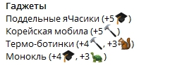

Данная одежда позволит вам иметь преимущество над остальными игроками. А на следующих уровнях докупить руки

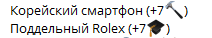

Но самое интересное нас ждёт ещё впереди. Для прокачки последующих уровней есть несколько предложений и каждый имеет свой смысл:

1. Прокачка через "*Гулять*", так как нас впереди ждёт много интересного, мы стремимся быстрее добраться туда. Деньги подымаются за счёт битв.
2. Прокачка через "*Работать*", не так быстро, но более эффективно по заработку денег. Дополнительно, можно попасть в топ работников (`/topjob`)
3. Прокачка через "*Офис*", один из альтернативных путей прокачки. Не так быстро, приличный перспективный заработок, работа на корпорацию.

Теперь вы уже знаете не мало и можете ознакомиться и переварить информацию о влиянии дополнительных фактов на битву, но это не обязательно, ознакомится с ними можно [тут](#дополнение-по-битвам).

### Лаборатории

Лаборатории представляют из себя исследовательский центр по изучению нового вида одежды. Каждый гаджет изучается отдельно и требует вложить в него 100% изучения и 100% разработки.

* "*Изучение*" — представят из себя более сложный процесс и требует 📚Знания(Доступный с 18 лвл), 2🔥, 5 💵, 6 ⏰.
* "*Разработка*" — более простой процесс и требует 🔩Сырьё, 2🔥,6 ⏰.

Свои вложения ресурсов в гаджет можно посмотреть зайдя в рабочую лабораторию. Во вложения входит вклад как изучение так и разработка.

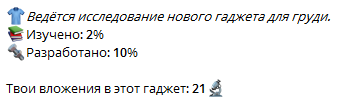

По окончанию разработки всего гаджета в зависимости от Вашего вклада будут начислены денежные средства, в размере 5 вклада на 1 акцию компании в её денежном эквиваленте. Допустим, что одна акция вашей компании стоит 26💵 Тогда, за 21 прогресс->4 акции->(4 акции*26)= 104 💵. Получить эти деньги можно сняв их со своего счёта нажать на `/lab_deposit` в меню *Лаборатории*.

Сейчас самое время рассказать про ежедневные дейлики (`/daily_quest`). Это ежедневное задание, которое обновляется в 00.00 по МСК и может принести Вам дополнительные ресурсы, опыт, заработок. Найти его можно в меню *Дела*.

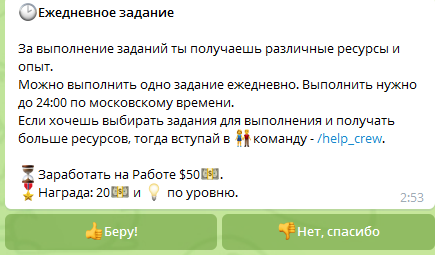

> **Совет:** Выбрать один дальнейший путь прокачки, разнообразить выполнением ежедневных заданий

Посмотрите на котика, отдохните, переварите прочитанное

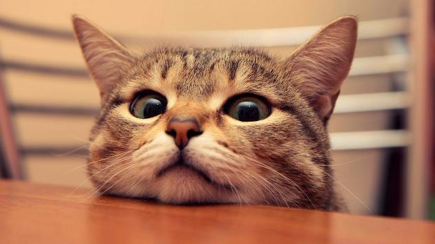

## 15 лвл

При переходе на 15 lvl, вам придется перейти на другого бота.

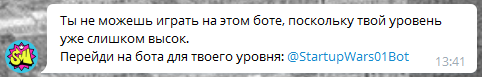

Не стоит беспокоиться, данная ситуация одноразовая и была сделана разработчиком для дальнейшей оптимизации игры. Прогресс остаётся, переходи.

## 18 лвл

Вот мы наконец таки и добрались до момента, когда ты уже совсем большой. С 18 уровня у нас появляется доступ к разделу *Стартап*.

*Стартап* — раздел, в котором можно добывать знания, а также вкладывать их непосредственно в Стартап. А он в свою очередь делится на уровни,в зависимости от уровня начисляются разные бонусы. На данный момент существует 4 уровня.

* **1 уровень** — (прогресс 100) - пассивный доход 1/час 💵
* **2 уровень** — (прогресс 200) - пассивный доход 2/час 💵, +10% прибавки 💡опыта ко всем Делам.
* **3 уровень** — (прогресс 300) - пассивный доход 3/час 💵, + 1 🔥 мотивации каждый чётный час(0,2,4...) - итого +12🔥 мотивации за сутки. Является самым важным стартапом, не прокачав его, вы теряете многое.
* **4 уровень** — (прогресс 450)- пассивный доход 4/час 💵, +1 🔩Сырьё каждый чётный час(0,2,4...) - итого +12 🔩 сырья за сутки.

Основным ресурсом для прокачки стартапа являются — "*📚Знания*". Для его добычи существует действие "*Учиться*" в меню "*🔮Стартап*".

"*📚Учиться*" — один из вариантов добычи *📚Знаний*, требования: 2🔥, 7 ⏰, по окончанию приносит 2-5📚.
"*🖥Пилить*" — конвертирует ресурсы 📚Знания в прогресс "🔮Стартап". Требования: 2🔥, 8 ⏰, а так же иметь минимум 2 📚Знания(исключение 4 уровень, так же требует 1🔩 Сырьё)

Вы по жизни удачливы, тогда самое время проверит насколько. При каждом действии "*🖥Пилить*", есть шанс закончить свой текущий уровень стартапа.
Шанс равен **100/n %**, где n - (100/200/300/450),нужное количество прогресса для его полного запила.

> **Совет:** Начинай пилить "*🔮 Стартап*" уже сейчас, не успеешь очнуться, а у тебя уже 3 уровень.

## 19 лвл

Не имеет большого значения, для людей которым понравилась атмосфера своей компании, так как с 19 у вас появилась возможность на смену компании, потеряв весь свой игровой процесс и начав новую жизнь с 1 лвл в другой компании. Сменить компанию можно в разделе `/settings` в игровом боте.

## 21 лвл

Открывается ещё один способ добычи 📚Знаний, менее стабильный, но более прибыльный — "*📚Конфа*".

"*📚Конфа*" — Не всегда самый удачливый вклад своих ресурсов. Требования: 3🔥, 7 💵, 8 ⏰. Но удачная конференция может принести от 22-54 знаний за 1 поход. Шанс удачной конференции 25%.

> **Совет:** По статистике, "Конфа" более выгодна, чем "Учиться", но если вы любите стабильность, то "Учиться" Вам никто не запрещает.

## 22 лвл

Представляет собой взрослую жизнь и открывает возможность к "*🏛Горбушке*".

"*🏛Горбушка*" — это локация, в которой ты можешь испробовать свои силы и получить ценные призы в виде 🎁коробочки, ⚪️заточек, ⚙️Детали.

"*⚙️Детали*" — один из видов ресурсов в игре, используется в 🛠Мастерской, добыть можно в 🏛Горбушке после победы над продаваном.

Цель "🏛Горбушки" — одолеть 3-х 👨Продаванов за 24 часа с момента покупки. Цена такого удовольствия 90💵 и 15📚 и по 1🔥за попытку. Одолев всех 3, Вы не только окупаете ее покупку, но и зарабатываете. После битвы с 1 продаваном, Вам придётся выждать 1 час для новой схватки, вне зависимости от результата предыдущей битвы. Если вы одолели всех 3 продаванов, то вы просто мощь 💪, а покупка новой Горбушки станет Вам доступна после 24 часов с момента покупки текущей.

> **!!Внимание!!** Проверяйте свою выносливость перед битвой с Продаванами, что бы не потерять лишний час, а так же пополняйте свою выносливость после битвы с ним.

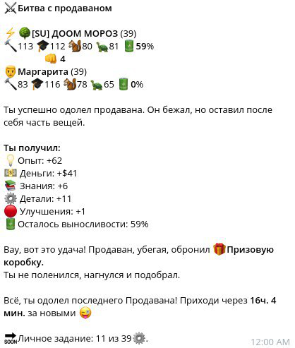

### Мастерская

После появления локации 🏛Горбушка, появился смысл в *🛠Мастерской*.
*🛠Мастерской* — локация которая позволяет дополнительно получать 🔩 сырьё.

Что бы получить 🔩 сырьё, требуется 1🔥, 5 💵, 10 ⚙️, 6 ⏰. Данная локация является самой прибыльной по добычи опыта 💡.

С каждым уровнем *⚙️Переработчика*, количество получаемого сырья растёт.

Уровни навыка "⚙️Переработчик":

1. Ломастер [10⚙️ => 1🔩]
2. Новичок [10⚙️ => 1-2🔩]
3. Ученик [10⚙️ => 2-3🔩]
4. Стажер [10⚙️ => 2-4🔩]
5. Помощник [10⚙️ => 3-5🔩]
6. Студент [10⚙️ => 3-6🔩]
7. Практикант [10⚙️ => 4-7🔩]
8. Главный помощник [10⚙️ => 4-8🔩]

## 23 лвл

Пропадает ежедневные дейлики в меню "*Дела*" и теперь дальнейшее продвижение зависит только от Вас. Теперь Вы можете попасть в [команду](#команда) и выполнять дейлики уже там.

Теперь ты настоящий взломщик. Удачи на полях сражений.

Ты думал это всё? Нееееет.😉

## Дополнительно

Помимо основной прокачки в игре существует и ряд других интересных вещей.

### Биржевики

Ночные жители SW, встретить их можно на локации "Гулять", в период с 22.00 до 8.00 по МСК. После нахождение биржевиков, вам дается 5 минут, для принятия решения о вступление с ними в схватку. Но знай, ты не одинок и можешь пригласить друзей кнопкой "Позвать друзей", отправив её в нужный вам чат.

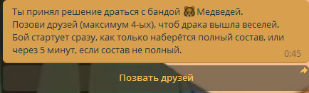

Аналогично так же вы можете присоединиться к другу, скинув с Чата в игровой бот игры.

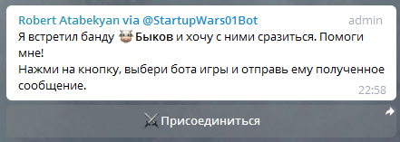

При победе над биржевиками Вы можете получить деньги 💵 в эквиваленте он нанесенного урона биржевикам, а так же небольшое количество знаний📚.

Но не всегда бои с биржевиками оканчиваются успешно, и они забирают 50% 💵от суммы вашей налички. За ночь одолеть биржевиков можно всего 1 раз, после чего они не будут попадаться Вам этой ночью, а так же как нельзя будет прийти другу на помощь. Бои проходят против биржевика твоего уровня, но распределение противников происходит по силе участников. При проигрыше своему противнику, его забирает старший товарищ.

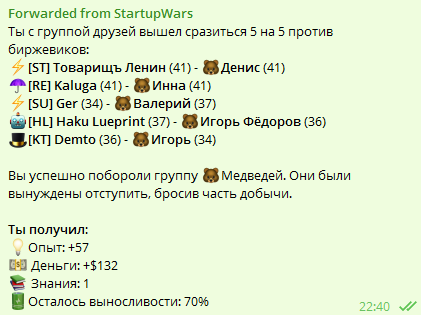

> **!!Внимание!!** Прежде чем вступать или начинать битву с биржевиками, проверьте свою выносливость. Не подвергайте опасности свою наличку и своих товарищей.

### Артефакты

На текущий момент игры существует несколько 👾артефактов:

**📦 Странная коробочка:**

* +1 к первому броску в 🎯дартсе, если бросок менее 20.
* 5% шанс найти ещё 1🔩 на Работе.
* До +3% к шансу выбить 🎁Призовую коробку с продавана.
* 5% шанс найти ещё 1📚 на Учёбе.
* Так же эффекты могут пополниться. Выпадает по праздникам.

**📕 Букварь стартапера:**

* За каждый уровень букваря шанс 0.5% получить +1📚 на Учёбе и +4📚 на Конфе.
* На 100 уровне букваря шанс удваивается и становится 100%.
* Пока можно приобрести только за SWCoins🌐.

**📠 SW факs:**

* Каждый уровень факса повышает шанс удвоить доход на работе вплоть до 62%.
* На 100 уровне факs-а получаешь +4⚙️ при его срабатывании.

> Количество артефактов может пополниться.

### Призовая коробка

*🎁Призовая коробка* — закрытая коробка, в которой можно найти нечто интересное (Опыт, деньги, знания, гаджет, заточки, призовая коробка)

Получить данную коробку можно в "Горбушке" с продавана, в "Офис" при завершении разработки гаджета (Ваш вклад в этот гаджет должен превышать 50🔬), а так же иногда появляется в [общем чате](https://t.me/startupwarschat) в ограниченном количестве. После получения коробки найти её можно в инвентаре и открыть не раньше 24 часов с момента её получения.

### Заточки

Я вижу ты круто одет, но ты хочешь стать ещё круче? Тогда это для тебя. Заточки повышают характеристики твоего снаряжения. Каждый лвл повышает уровень его характеристик на 1%.

Существует 3 вида заточек с разным шансом успеха:

* ⚪️ простые (60%) - можно приобрести одну за 499💵 (не более 13 в день), за акции ценой 65+💵, за SWCoin🌐, Горбушка🏛, Призовая коробка🎁.
* 🔵 редкие (70%) - SWCoin🌐, Горбушка🏛, Призовая коробка🎁.
* 🔴 уникальные (80%) - SWCoin🌐, Горбушка🏛, Призовая коробка🎁.

При каждом Не успехе качается профессия 🗜Апгрейдмэн, что позволит поднять дополнительно ваш шанс заточки максимум на 5%.

Для более подробной информации используйте команду (`/help_upgrades`) в боте.

> **Совет:** прокачивай 🗜Апгрейдмэн используя ⚪️ простые заточки, параллельно накапливая 🔵 редкие и 🔴 уникальные.

### SWCoin

*SWCoin🌐* — игровая донат валюта, Расценки на данную валюту можно посмотреть введя команду `/donate`, а возможные покупки за валюту SWCoin🌐 можно посмотреть командой `/donations` основной вклад происходит для покупки уникальных заточек или покупки бейкера или премиума.

### Дополнение по битвам

Все не так просто как это было описано в краткой части, более полная картина насчитывает в себе такие условия:

*😔Печаль стартапера* — представляет из себя общий дебафф на всю компанию. Максимальный уровень печали — 5 лвл.

За каждый уровень печали отнимается 5% к нанесённому урону в ⚔️битвах, что пропорционально уменьшает 💵доход и 🏆вклад. +1 уровень (от 1 до 5) за каждый взлом твоей компании. Сбрасывается в 0 при успешной защите.

*😡Ярость Стартапера* — это личный бафф для каждого персонажа, начисляется при атаке на удачно защитившуюся компанию.

За каждый уровень ярости вы получаете прибавку

* +10% к бонусу 🔨Практики/🐿Хитрости на взломе.
* +10% к бонусу 🎓Теории/🐢Мудрости в защите.

Чем больше напарников из твоей команды, тем больше прибавка и тем выше влияние Ярости стартапера.

*Плечом к плечу* — бонус от количеств атакующих определенное направление или защищающих свою компанию вместе со своими товарищами по корпорации.

* Взлом: Максимальная прибавка от бонуса плечом к плечу к 🔨Практике — 60%, к 🐿Хитрости — 20%. Эти прибавки будут только в том случае, если все игроки компании пошли взламывать одну компанию. Данный бонус набирается уже при половине участвовавших игроков вашей компании в битве за данную корпорацию, чем меньше людей, тем меньше бонус.
* Защита: Максимальная прибавка от бонуса плечом к плечу к 🎓Теории — 80%, к 🐢Мудрости — 20%. Данная прибавка достигается уже при половине игроков оставшихся в защите.

"*Это наша корова и мы её доим*" — представляет собой шанс встретить в нападении взломщика другой компании и сразится с ним. Этот шанс зависит от соотношения "общее кол-во взломщиков/общее кол-во защитников". И варьируется в пределах от 0% (не нападают друг на друга, когда защитников больше) до максимальных 20% (когда взломщиков сильно больше, чем защитников).

Более подробно о битвах и ВСЕХ нюансах можно ознакомиться по команде `/help_battle` в игровом боте.

Чтобы не листать общий чат для поисков общих результатов, всегда можно зайти на [канал](https://t.me/startupwarsreport) посвященный результатам битв и изменениям стоимости акций.

### Команды

Это группа людей из 1 компании, объединенных в команду под уникальным тегом. Вы можете создать свою команду и вести её в топ или же присоединиться в существующую команду из своей корпорации.

Команда дает возможность получить дополнительный опыт и ресурсы. Для этого представляется каждый день в 00.00 по МСК 2 типа заданий на выбор,

*Личное задание* — уникальное личное задание, сложность и тип которого ты выбираешь сам. Вступает в силу после его принятия. По окончанию выполнения вы получите награду за задание, опыт, а так же принесёте кубки своей команде.

*Командное задание* — общее задание на команду, внести свой вклад в него может каждый его участник. Выбор этого задание предоставляется руководителю команды или его помощнику. По завершению задания все участники команды получают опыт в зависимости от лвл игрока, а так же начисляются кубки на счет команды. Более подробно можно почитать с помощью команды `/help_crew` в игровом боте.

Создать команду или вступить в команду можно за SWcoin🌐 или получить бланк на вступление.

### Битва за Фабрику

Дополнительный контент игры в команде. В 18.30 по МСК происходит битва между командами, запись на битву происходит с 18.00 по 18.15. На битву проходят 15 сильнейших записавшихся игроков команды.

В качестве приза за победу, оставшаяся 1/3 от суммы взносов делится на 2 части. Первая часть уходит в казну команды-победителя. Вторая часть равными долями уходит на руки всем участвовавшим в битве игрокам этой команды. Даже если некоторые из них пали в первом или втором раунде.

За участие в битве можно получить 💵 часть денег, 💡опыт, ⚪️простые улучшения.

За победу в битве можно получить💡опыт, ⚪️простые улучшения, 🔵редкие улучшения. Все кто выстоял после битвы получают дополнительно 🔴уникальные улучшения.

Команда победитель получает в казну +30 📚знаний и +30 🔩сырья, но пропускает следующий день битвы за фабрику. Даёт шансы другим командам победить.

Более подробно как проходит битва и распределение ресурсов можно прочитать по команде `/help_factory` в игровом боте.

### Помощники

На текущий момент есть такие помощники:

* *🐕Верный пёс* — телохранитель. Помогает на прогулке, запиле стартапа, разработке гаджетов и переработке деталей в мастерской.
* *🐀Серая мышка* — секретарь. Эффективна на работе, учёбе, конфах и изучении гаджетов.

Данные помощники могут приносить следующие бонусы:

**🐀Серая мышка:**

* на работе добывает от +$2 (при 50 ❤️) до +$12 💵 (при 300 ❤️).
* на учёбе добывает от +1 до +6 📚.
* на конфе добывает от +4 до +24 📚 (по 4 за каждые 50 ❤️).
* вкладывает в изучение гаджета от +1 до +6 📚 больше за подход (при наличии 📚 у игрока).

**🐕Верный пёс:**

* на прогулке получает от +10% до +60% больше опыта.
* вкладывает в запил стартапа от +1 до +6 📚 за подход (при наличии 📚 у игрока).
* вкладывает в разработку гаджета от +1 до +6 🔩 больше за подход (при наличии 🔩 у игрока).
* получает +1 до +3 🔩 (по 0.5 🔩 за каждые 50 ❤️) при переработке ⚙️ в мастерской (дополнительные ⚙️ не тратятся).

Каждый питомец требует потребляет свой вид еды: 🧀Сыр для 🐀мышки, 🍗Мясо для 🐕 пса.

У каждого из питомцев есть 4 характеристики:

* *🍀Удача* — главный навык, что влияет на шанс добыть/вложить больше ресурсов. Шанс добыть/переработать ресурс можно увеличить до 50%, а так же снижает шанс не удачу. А так же удача пета влияет на шанс добыть для него еду из фастфуда. Более подробно про удачу можно прочитать по команде `/help_pets1` в игровом боте.
* *👓Интеллект* — каждая 1 интеллекта снижает время на выполнение заданий в любимых местах пета на 1 секунду, но не более чем в половину времени.
* *🔋Выносливость* — чем выше выносливость, тем реже пету необходимо есть.
* *❤️Преданность* — чем выше преданность, тем больше ресурсов питомец может добыть/переработать.

Для более подробнее про добычу еды для питомца можно прочитать в `/help_pets` в игровом боте.

### Переезд

Если у Вас имеется аккаунт в CW (запрещенная организация на территории SW), то Вы можете сэкономить себе время на прокачку. Для этого в Игрового бота требуется написать команду `/fromcw`, сделав всё по инструкции, вы получите свои награды, бонусы, лвл. Обязательно прочтите весь гайд с самого [начала](#2-5-лвл), для получение полной информативности.

### Чаты и каналы

* Самые актуальные и свежие новости по обновлению игры можно почитать на [канале разработчика](https://t.me/StartupWars).
* [Общий чат](https://t.me/startupwarschat)
* [Канал](https://t.me/startupwarsreport) посвященный результатам битв и изменениям стоимости акций
